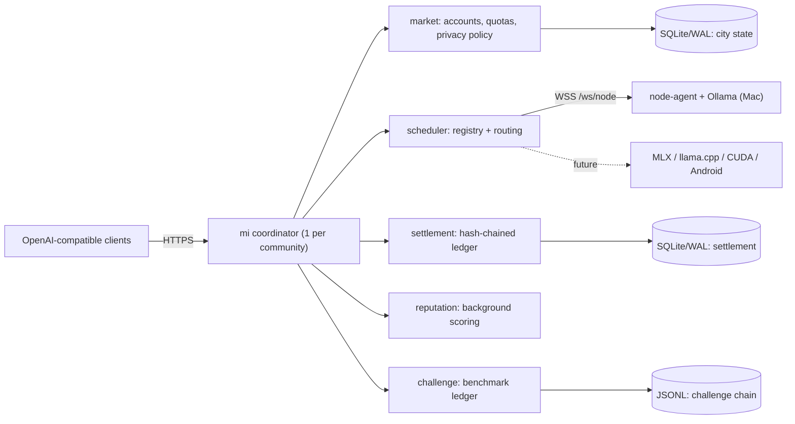

# mi — Architecture

This document describes the architecture of `mi`, its trust model, its failure
semantics, and its deliberate tradeoffs. It is written to be read critically. We
state what `mi` guarantees, what it does **not**, and why each boundary is where
it is. If a claim here disagrees with the code, the code is the source of truth
and this document is a bug.

## 1. Purpose and scope

`mi` is a **local-first cooperative inference control plane**. It turns a set of
provider machines inside a single trusted community — an office, school,
coworking space, lab, clinic, or agency — into one OpenAI-compatible inference
endpoint, with accounting, quotas, reputation, and tamper-evident usage logs.

The working backend today is Apple Silicon + Ollama. Heterogeneous backends
(MLX, llama.cpp, CUDA/vLLM, Snapdragon/QNN, LiteRT, Android) are roadmap, and the
node protocol carries the metadata needed for them, but only Ollama is
implemented in this repository.

## 2. The trust unit (the decision everything derives from)

**One community is one trust domain, and one trust domain is served by one
coordinator.**

This is the single most important architectural choice in `mi`, and it is
deliberate. A community is a group of people and machines that already trust each
other socially. Inside that boundary, a single coordinator that is also the
single source of truth is not a weakness — it is the right amount of mechanism:

- The settlement ledger is a **single serial writer** with a hash chain. Within
  one trust domain this is a feature: it is simple, totally ordered, and
  auditable without any consensus protocol to justify.
- Privacy is enforced by **routing policy plus social trust**, not by
  cryptography. That is honest and sufficient when the operators and members
  already trust each other.

`mi` does **not** try to be a single coordinator that serves multiple mutually
distrusting communities. The answer to "more than one community" is **federation
of coordinators** (§12), not sharding one coordinator or adding distributed
consensus to the ledger. We would rather have a correct, boring single-writer
ledger per community than a half-correct distributed one.

If you only remember one thing: **`mi` scales by adding coordinators, not by
making one coordinator scale.**

## 3. Non-goals

These are explicit. A reviewer should hold us to them.

- **Not a trustless DePIN network.** There is no proof-of-inference, no slashing,
  no on-chain settlement.
- **Not a payment rail.** Settlement is cooperative accounting (internal credits,
  invoices, off-platform payouts). It is not money movement and must not be
  described as such.
- **Not cryptographic privacy.** Prompt content is visible in cleartext to the
  node that runs inference. Privacy tiers restrict *where* a request may be
  routed; they do not hide it from the chosen machine.
- **Not a multi-tenant public cloud.** A coordinator serves one trust domain.
- **Not horizontally scalable as a single instance.** See §2 and §10.
- **Not exact metering.** Token accounting is a coordinator-side estimate, not
  model-family tokenizer parity (§7).

## 4. Components

`mi` is two binaries plus a set of internal packages. Today the coordinator is a
single process; the internal packages have clear responsibilities and are the
seams along which the process would be decomposed if it grew (§13).

**coordinator** (`coordinator/cmd/coordinator`) — the control plane. Hosts the
OpenAI-compatible HTTP API, the node WebSocket endpoint, the scheduler, the
ledgers, the reputation refresher, the challenge runner, the admin API, the
dashboard, and the metrics endpoint.

**node-agent** (`node-agent/cmd/node-agent`) — runs on each provider machine. It
**dials out** to the coordinator over WebSocket (no inbound ports), registers its
models/hardware/privacy tiers, heartbeats liveness, and streams inference output
back. It wraps a backend `Runtime` (Ollama today).

Internal packages: `scheduler` (node registry + routing), `city` (market:
accounts, quotas, privacy policy, persistence), `settlement` (hash-chained
accounting), `reputation` (provider scoring), `challenge` (benchmark ledger),
`modelcatalog` (model alias resolution), `protocol` (wire messages), `privacy`
(tier normalization), `backend` (inference runtime interface), `sqlitestore`
(persistence).

## 5. Request lifecycle (inference)

1. Client calls `POST /v1/chat/completions` with a consumer API key.
2. The coordinator authenticates the consumer and **checks quota**. A
   `QuotaReservation` is taken up-front using an estimated token budget so
   concurrent requests cannot overspend the same limit.
3. The requested privacy tier is normalized. The model alias is resolved to a
   concrete backend model.
4. The scheduler selects a node: filtered by model availability, health,
   cooldown, privacy tier, capability hints, and free capacity, then ranked by a
   cost function over utilization, queue depth, error streak, provider
   reputation, and observed latency/TTFT/throughput.
5. The coordinator sends an `infer` envelope to the node over its WebSocket and
   streams chunks back to the client as SSE.
6. **The coordinator measures the output itself** (`meteredSink` counts streamed
   bytes) rather than trusting the node's self-reported token counts.
7. On completion: the reservation is reconciled to measured usage, and a
   settlement event is appended to the hash chain (debit, provider reward, SLA
   penalty, latency, attempts, previous hash, current hash).

**Failover is pre-first-token only.** If a node fails before emitting any output,
the scheduler retries another node. Once the first token has streamed, the
request is pinned — we never silently restart a partially streamed response on a
different node.

## 6. Trust and privacy model

- **Transport**: HTTPS/WSS; optional node mTLS on `/ws/node` so only nodes with a
  trusted client certificate can join.
- **Identity**: consumer API keys, provider tokens, admin bearer token. Secrets
  are stored hashed; rotation and disable are supported.
- **Privacy tiers** (`private`, `community`, `public`) are **routing policy**.
  A public/rented node cannot receive `private`/`community` work; a provider
  cannot self-promote to private routing by editing its own node config because
  the coordinator enforces the provider account's policy at registration.
- **Cleartext to the chosen node.** The node that runs inference sees the prompt.
  This is the core honest limitation: `mi` protects *which machine* sees data,
  using community trust + routing + reputation + auditability — not encryption of
  the prompt from the executor.
- **No prompt bodies in ledgers.** Settlement and challenge records store
  metadata and hashes, never prompt or completion content.

## 7. Accounting and settlement

Settlement is **cooperative accounting**. It produces a totally-ordered,
tamper-evident log of usage and provider rewards within one community, suitable
for internal credits, invoices, or off-platform payouts.

**What the hash chain guarantees:** that recorded events have not been *edited*
after the fact (each event commits to the previous hash; `/admin/settlement/verify`
re-walks the chain).

**What it does not guarantee:** it does not prevent the operator from deleting the
file or choosing not to record an event, and it is not a distributed ledger. For
external trust, publish the `/admin/integrity` anchor hash (which binds settlement
and challenge state) to a timestamping service or transparency log.

**Metering is an estimate.** The coordinator counts streamed output bytes and
estimates tokens as `bytes/4`. This is honest-but-approximate: it is wrong for
non-Latin scripts and for code, and it is not model-family tokenizer parity. It
is acceptable for cooperative accounting between members who trust each other; it
is **not** acceptable as a basis for real money, and we do not present it as such.
A default `max_tokens` cap bounds output so a provider cannot inflate reward with
unbounded generation.

**Why a single serial writer.** The chain is intentionally serial (§2). It bounds
settlement throughput to one writer, which is fine for one community and is the
price we pay for a simple, auditable, consensus-free ledger.

## 8. Scheduling and routing

The scheduler keeps an in-memory registry of connected nodes, updated by
registration and heartbeats. Routing is two-phase: **filter** (model, health,
cooldown, privacy tier, capability hints, capacity) then **rank** by a cost
function.

Observed performance (latency, TTFT, tokens/sec) is measured by the coordinator
during dispatch and smoothed with an EWMA. Provider reputation is computed off
the hot path by a **background refresher** and fed into routing as a score; it is
not recomputed per request.

Known limitations (stated, not hidden):

- The `MaxConcurrent` "slots" model is a crude fit for continuous-batching
  backends (e.g. vLLM), where throughput is non-linear in batch size. It is
  correct for Ollama-style serving today.
- There is **no prefix/KV-cache affinity**: a multi-turn conversation may be
  routed to different nodes, discarding prefix cache. Acceptable now, a known
  cost for chat-heavy workloads.
- There is **no admission control / queueing**. At capacity the coordinator
  returns `503` immediately rather than shedding load or queueing.

## 9. Persistence and state

- `data/mi-city.db` — SQLite/WAL: consumers, providers, hashed secrets, quotas,
  usage.
- `data/mi-settlement.db` — SQLite/WAL: hash-chained settlement events.
- `data/challenge-chain.jsonl` — append-only benchmark challenge ledger.

Backups and the integrity anchor are documented in [docs/backups.md](docs/backups.md).

**Inconsistency we acknowledge:** settlement moved to SQLite/WAL while the
challenge ledger is still JSONL. Two persistence mechanisms is a wart; converging
on one is tracked work, not a claimed feature.

## 10. Failure model and availability

We state failure behavior explicitly because this is where the architecture is
weakest today and a reviewer should see that we know it.

- **Single point of failure.** The coordinator is one process and the single
  source of truth. If it dies, the control plane is down until it restarts.
  In-flight requests fail; nodes reconnect on restart.
- **Crash consistency of billing is best-effort, not transactional.** Quota
  reservation, usage recording, and settlement append are separate steps. A crash
  between streaming completion and settlement append can lose a settlement event;
  there is no idempotency key or write-ahead intent log binding the charge to the
  request yet. This is the most important correctness gap and is **not** safe for
  money in its current form.
- **No graceful shutdown.** There is no SIGTERM handler; the process does not
  drain in-flight requests or flush/close ledgers cleanly on signal (ledger
  `Close()` runs only on serve error). WAL makes this survivable but not clean.
- **Reconnect storms.** Node agents reconnect on a fixed 2s delay without jitter,
  which can cause a thundering herd after a coordinator restart.

**Availability plan (single-coordinator-appropriate):** active-passive with
continuous backup of the SQLite databases (e.g. Litestream-style streaming
replication to object storage), with manual or scripted failover. We deliberately
do **not** add distributed consensus — that would contradict §2.

## 11. Protocol and versioning

The node↔coordinator wire protocol is JSON over WebSocket: a single `Envelope`
with a `type` tag and optional typed payloads (`register`, `heartbeat`, `infer`,
`chunk`, `done`, `error`). A `version` field exists on the envelope and register.

Honest status: the version field is **reserved but not yet negotiated** — the
coordinator does not branch on or reject incompatible versions. The current
forward-compatibility story is JSON's tolerance of added fields. Before the
protocol stabilizes for heterogeneous agents we intend to: define explicit
message-type compatibility rules, actually negotiate/reject on version, and
evaluate a schema/IDL (protobuf or similar) for the wire format. Until then,
treat the protocol as v0 and unstable.

## 12. Scaling: the federation seam (future, not built)

When more than one community is involved, the unit of composition is a whole
coordinator, not a shard of one.

The intended (and explicitly **unimplemented**) seam:

- Each community runs its own coordinator with its own serial ledger.
- Coordinators periodically publish their integrity anchor hash to a shared,
  append-only root (timestamping service / transparency log), giving
  cross-community tamper-evidence without a shared write path.
- Cross-community routing (one community renting non-sensitive capacity to
  another) is a **federation peering** concern between coordinators, gated by
  the `public` privacy tier, and is out of scope for the current code.

We document this so the single-coordinator decision reads as a deliberate
boundary with a known exit, not as a dead end.

## 13. Deliberate tradeoffs

| Decision | We chose | We gave up | Why |
| --- | --- | --- | --- |
| Trust unit | One coordinator per community | Single-instance multi-tenancy | Matches real trust boundaries; avoids consensus |
| Ledger | Serial hash chain, single writer | Horizontal settlement throughput | Simple, auditable, consensus-free within a community |
| Privacy | Routing policy + social trust | Cryptographic privacy from the executor | Honest and sufficient for trusted communities |
| Metering | Coordinator-measured `bytes/4` estimate | Exact tokenizer parity | Removes provider self-report fraud; good enough for cooperative accounting |
| Scaling | Federation of coordinators | Sharding one coordinator | Keeps each ledger correct and simple |
| Backend | Ollama only today | Breadth | Ship one correct path before generalizing |

## 14. Known limitations (consolidated)

For convenience, the honest list a reviewer should check against the code:

1. Single coordinator: SPOF and single source of truth; no HA in-tree yet (§10).
2. Billing is not fully crash-transactional across the usage and settlement
   ledgers. Idempotency keys (charge-at-most-once per request) are implemented;
   the remaining cross-ledger atomicity is designed in
   [docs/atomicity-design.md](docs/atomicity-design.md) but not yet implemented.
3. Graceful shutdown (SIGTERM drain) and signal handling are implemented.
4. Metering is `bytes/4`, not tokenizer parity; not safe for real money (§7).
5. Privacy tiers are routing, not encryption from the executor (§6).
6. Protocol `version` is reserved but not negotiated; protocol is v0 (§11).
7. No admission control/queueing; `503` at capacity (§8).
8. No prefix/KV-cache affinity; crude `MaxConcurrent` model for batching
   backends (§8).
9. Two persistence mechanisms (SQLite + JSONL) pending convergence (§9).
10. Only Ollama is a real backend; everything else is roadmap.

These are not surprises to find in review; they are the current, deliberate state
of an early-stage cooperative control plane with an honest trust model.
