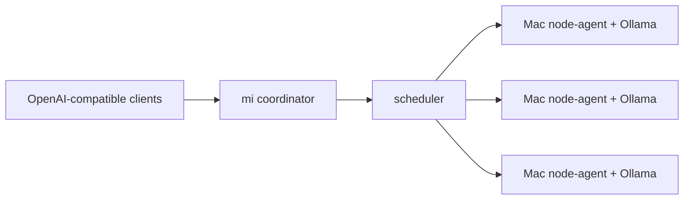

# mi

`mi` turns a local fleet of Apple Silicon Macs into one OpenAI-compatible inference endpoint.

The first version is LAN-first and intentionally small:

- A `coordinator` exposes `/v1/chat/completions` and `/v1/models`.
- Each Mac runs a `node-agent` that connects outbound to the coordinator over WebSocket.
- Nodes serve requests through Ollama today, with the backend boundary ready for MLX later.
- The scheduler routes by model availability, health, queue depth, memory pressure, and measured latency.
- The scheduler retries another node automatically if a provider fails before the first streamed token.
- Unstable nodes enter short cooldowns and recover automatically after a successful request.
- City mode lets multiple consumers and providers share compute with API keys, provider tokens, and usage accounting.

## Architecture



## Quickstart

Start Ollama on every Mac node and make sure the desired model exists:

```bash
ollama pull llama3.1:8b
```

Run the coordinator:

```bash
go run ./coordinator/cmd/coordinator -config configs/coordinator.yaml
```

Run a node agent on each Mac:

```bash
go run ./node-agent/cmd/node-agent -config configs/node-agent.yaml
```

Call the cluster:

```bash
curl http://localhost:8080/v1/chat/completions \
  -H 'Content-Type: application/json' \
  -d '{
    "model": "fast",
    "messages": [{"role": "user", "content": "Say hello from the Mac fleet"}],
    "stream": true
  }'
```

`fast` is a model alias. The coordinator resolves it to the concrete model advertised by nodes, such as `llama3.1:8b`.

## Status

This is an MVP scaffold. It already includes the core control-plane shape, but the first production hardening pass should add TLS/mTLS, persistent node identities, stronger model management, dashboard auth, and MLX-native backends.

## City mode

For a shared neighborhood/city deployment, see [`docs/city-network.md`](docs/city-network.md).

```bash
make run-city-coordinator
make run-city-node
make city-smoke
```

Enroll city accounts dynamically:

```bash
CONSUMER_ID=studio-b make city-enroll
PROVIDER_ID=neighbor-mac make city-enroll
ACTION=rotate CONSUMER_ID=studio-b make city-enroll
ACTION=disable PROVIDER_ID=neighbor-mac make city-enroll
```

Secure transport is covered in [`docs/security.md`](docs/security.md):

```bash
make dev-certs
make run-city-coordinator-tls
make run-city-node-tls
```

The TLS example includes mTLS for node agents.
