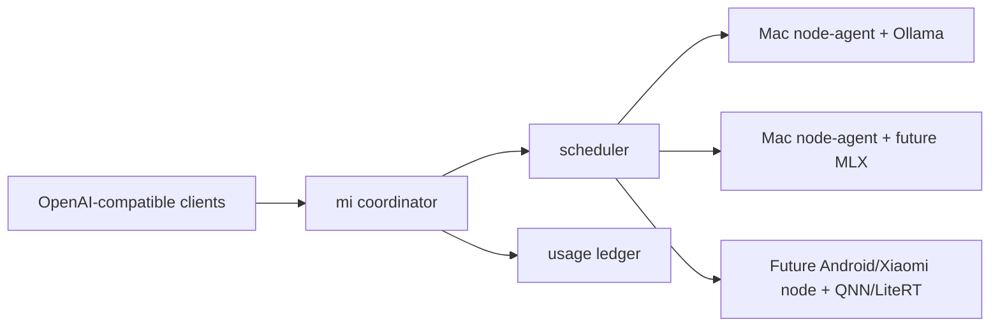

# mi

Local-first distributed inference for Apple Silicon and future ARM edge fleets.

`mi` turns a group of local machines into one OpenAI-compatible inference endpoint. It starts with Apple Silicon Macs, and the architecture is being shaped for future Android, Snapdragon, and Xiaomi edge nodes.

The project is early, but the core control plane is already here: a coordinator, outbound node agents, OpenAI-compatible chat completions, model aliases, provider enrollment, quotas, usage accounting, TLS/mTLS, failover, cooldowns, and privacy tiers for rented compute.

## Why

Many organizations already own underused Apple Silicon machines. `mi` lets them pool that capacity.

It helps with:

- Local AI capacity for teams that want lower latency and more control.
- Small-business inference without committing to cloud GPU infrastructure.
- Shared city or coworking deployments where many users contribute or consume compute.
- Rented public capacity for non-sensitive workloads.
- Private routing for sensitive workloads that must stay on trusted nodes.

## What It Does

- Exposes `/v1/chat/completions` and `/v1/models`.
- Lets each provider machine connect outbound as a `node-agent`.
- Serves local models through an inference backend abstraction. Ollama is supported today, with room for MLX, QNN, LiteRT, and Android runtimes later.
- Routes by model availability, health, queue depth, capacity, cooldowns, privacy tier, and optional backend/hardware hints.
- Retries another node when a provider fails before the first streamed token.
- Tracks usage for both consumers and providers.
- Supports API keys, provider tokens, quota limits, dynamic enrollment, rotation, and revocation.
- Reserves quota before dispatch so concurrent requests cannot spend the same budget twice.
- Records optional hash-chained settlement events for consumer debits and provider rewards.
- Supports HTTPS/WSS and node mTLS.
- Enforces provider-side privacy policy so public rented nodes never receive private prompts.

## Architecture



## Requirements

- macOS on provider machines.
- Apple Silicon recommended.
- Go 1.23 or newer.
- Ollama installed on each node.
- A local model, for example `llama3.1:8b`.

Install the basics:

```bash
brew install go ollama
ollama serve
ollama pull llama3.1:8b
```

## Quickstart

Clone and build:

```bash
git clone https://github.com/raym33/mi.git
cd mi
make build
```

Run the coordinator:

```bash
go run ./coordinator/cmd/coordinator -config configs/coordinator.yaml
```

Run a node agent on each Mac:

```bash
go run ./node-agent/cmd/node-agent -config configs/node-agent.yaml
```

Call the cluster:

```bash
curl http://localhost:8080/v1/chat/completions \
  -H 'Content-Type: application/json' \
  -d '{
    "model": "fast",
    "privacy_tier": "private",
    "messages": [{"role": "user", "content": "Say hello from the Mac fleet"}],
    "stream": true
  }'
```

Run the smoke test:

```bash
make smoke
```

## City Mode

City mode turns `mi` into a small local inference network with consumers, providers, provider tokens, API keys, quotas, and usage accounting.

```bash
make run-city-coordinator
make run-city-node
make city-smoke
```

Enroll accounts dynamically:

```bash
CONSUMER_ID=studio-b make city-enroll
PROVIDER_ID=neighbor-mac make city-enroll
ACTION=rotate CONSUMER_ID=studio-b make city-enroll
ACTION=disable PROVIDER_ID=neighbor-mac make city-enroll
```

See [City Network](docs/city-network.md) and [Android And Xiaomi Roadmap](docs/android-xiaomi.md).

## Renting Compute Privately

`mi` supports privacy tiers for shared and rented compute:

- `private`: sensitive data, routed only to trusted private nodes.
- `community`: known shared networks, routed to private or community nodes.
- `public`: non-sensitive prompts that can use rented public capacity.

If `privacy_tier` is omitted, requests default to `private`.

A public rented provider node can be configured with:

```yaml
privacy_mode: "public"
```

Set the same policy on the provider account in the coordinator. The coordinator enforces the provider account policy, so a node cannot elevate itself from `public` to `private` by changing its local config.

See [Renting Compute Privately](docs/rental-privacy.md).

## Settlement And Rewards

City deployments can enable a tamper-evident settlement chain. It records request metadata, coordinator-estimated token usage, latency, dispatch attempts, consumer debits, provider rewards, optional SLA penalties, and linked hashes without storing prompt bodies.

Provider reputation combines node health, cooldowns, error streaks, completed settlement events, tokens served, accrued rewards, and benchmark challenge results. The scheduler uses that provider score as a routing signal, so weak evidence or failed challenges can push traffic toward healthier providers.
Benchmark challenge events can be recorded manually or by an optional synthetic runner in a separate hash-chain and feed provider reputation. Synthetic challenge requests use normal chat-shaped request IDs so nodes cannot simply detect a `challenge-` prefix.

See [DePIN Settlement And Rewards](docs/depin-settlement.md).

## Security

For real deployments, use HTTPS/WSS and node mTLS:

```bash
make dev-certs
make run-city-coordinator-tls
make run-city-node-tls
```

See [Security](docs/security.md).

Admin endpoints require `admin_token` by default. For throwaway local development only, set `dev_admin_open: true`.

Important: privacy tiers enforce scheduling policy. They do not make prompts cryptographically invisible to the machine performing inference. Sensitive prompts should only be routed to trusted nodes until stronger confidential-compute techniques are implemented.

## Project Status

`mi` is an MVP for local-first distributed inference. It is useful for experimentation, LAN deployments, and early community networks. It is not yet a complete payment network, hosted SaaS, trustless DePIN, or cryptographically private compute marketplace.

The next major work is pricing, observability, reputation tuning, installer polish, MLX-native inference, and stronger private-compute options.

See [Roadmap](ROADMAP.md).

## Contributing

Contributions are welcome. The best current areas are:

- macOS provider installation and LaunchAgent support.
- Scheduler improvements and benchmarks.
- Prometheus metrics and dashboard work.
- MLX backend support.
- Pricing and provider payout ledger design.
- Security reviews.
- Documentation and example deployments.

See [Contributing](CONTRIBUTING.md).

## Development

```bash
make test
make build
```

Useful commands:

```bash
make smoke
make city-smoke
make dev-certs
```

## License

MIT. See [LICENSE](LICENSE).
