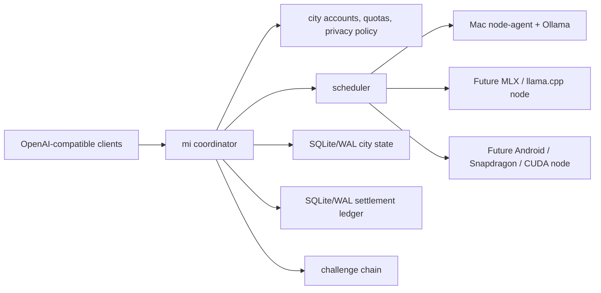

# mi

A private, OpenAI-compatible AI gateway for your team — running on your own machines.

`mi` pools the computers you already have (Apple Silicon Macs running Ollama) into **one OpenAI-compatible endpoint** your tools can point at. You get per-user API keys, quotas, usage visibility, and routing that keeps sensitive prompts on trusted machines — without sending anything to a third-party API. Provider machines connect **outbound**, so they work behind NAT with no inbound ports to open.

It is a focused, self-hostable gateway, not a hosted service and not a token network. Stand it up for an office, studio, lab, school, or clinic in about 15 minutes.

## What Problem It Solves

A small team has capable machines sitting idle and tools that speak the OpenAI API, but doesn't want to run cloud GPUs or send every prompt to an external provider.

`mi` gives them:

- **One endpoint for many machines** — drop-in `/v1/chat/completions` and `/v1/embeddings`, so existing OpenAI-compatible tools work unchanged.
- **Per-user accounts** — API keys, token quotas, and usage visibility per consumer.
- **Privacy by routing** — keep sensitive work on trusted (`private`) machines; only non-sensitive work goes to shared (`public`) ones.
- **No open ports** — nodes dial out over WebSocket; ideal for laptops/desktops behind NAT.
- **Operator-friendly** — built-in admin dashboard, Prometheus metrics, graceful shutdown, SQLite/WAL state with backups, TLS/mTLS.
- **Optional usage accounting** — a tamper-evident, per-request usage log you can use for internal cost-sharing or invoicing. It is cooperative accounting, not a payment system; `mi` does not move money.

Try it with no Ollama in one command: `make demo` (see below).

## Implemented Today

Core API:

- `POST /v1/chat/completions`
- `GET /v1/models`
- `GET /v1/models/catalog`
- `GET /v1/me`
- OpenAI-style streaming Server-Sent Events.
- Stable model aliases such as `fast` or `private` mapped to concrete backend models.
- `Idempotency-Key` replay protection for non-streaming chat retries.

Coordinator and nodes:

- Provider machines connect outbound to `GET /ws/node`; they do not need inbound ports.
- Node agents currently serve models through Ollama.
- Nodes advertise model IDs, backend type, hardware kind, vendor, SoC, accelerators, capacity, and privacy tiers.
- The scheduler routes by model availability, health, queue depth, capacity, cooldowns, privacy tier, provider reputation, and optional hardware/backend hints.
- Failover retries another node only before the first streamed token. After output starts, the request stays pinned to that node.

City network mode:

- Consumer accounts with API keys.
- Provider accounts with provider tokens.
- Dynamic enrollment, key rotation, token rotation, and disable operations through admin endpoints.
- Quotas and pre-dispatch quota reservations, so concurrent requests cannot spend the same limit twice.
- Coordinator-estimated usage accounting for consumers and providers.
- SQLite/WAL persistence for city state.
- Legacy JSON state remains supported for development.

Settlement and reputation:

- Optional tamper-evident settlement ledger for successful requests.
- Records request metadata, coordinator-estimated tokens, latency, dispatch attempts, consumer debit, provider reward, SLA penalty, previous hash, and current hash.
- SQLite/WAL settlement storage by default in city examples.
- Legacy JSONL settlement chains remain supported.
- Provider reputation from node health, cooldowns, error streaks, settlement history, rewards, SLA penalties, and challenge results.
- Background reputation refresh outside the per-request hot path.
- Coordinator-observed latency, TTFT, estimated tokens/sec, and failure rate feed scheduling cost.
- Optional benchmark challenge chain and synthetic challenge runner.
- `/admin/integrity` exports an anchor hash over settlement and challenge verification state.
- `/admin/dashboard` serves a minimal operator dashboard for nodes, health, usage, rewards, cloud-savings estimates, integrity, and reputation.
- `/admin/metrics` exposes Prometheus-style operator metrics for nodes, settlement, and challenges.

Security and privacy controls:

- Consumer API keys.
- Provider tokens.
- Admin bearer token.
- HTTPS/WSS examples.
- Node mTLS example for `/ws/node`.
- Coordinator-enforced privacy tiers: `private`, `community`, and `public`.
- Public provider accounts cannot self-promote to private routing by editing node config.
- Prompt bodies are not stored in settlement or challenge ledgers.

Heterogeneous fleet groundwork:

- Request hints: `mi_backend`, `mi_device_kind`, `mi_soc`, `mi_accelerators`.
- Header hints: `X-Mi-Backend`, `X-Mi-Device-Kind`, `X-Mi-SoC`, `X-Mi-Accelerator`, `X-Mi-Accelerators`.
- Node protocol version fields reserved for gradual agent upgrades.
- Hardware metadata designed for future MLX, llama.cpp, QNN, LiteRT, CUDA, Linux, Windows, and Android agents.

## Not Implemented Yet

Be precise about the current trust model:

- There is no built-in payment processor.
- There is no trustless proof of inference.
- Settlement is cooperative accounting, not a public blockchain.
- Token accounting uses a coordinator-side heuristic, not exact model-family tokenizers.
- Privacy tiers control where prompts are routed; they do not make prompts cryptographically invisible to the machine doing inference.
- Ollama is the only implemented backend today.
- MLX, Android, Snapdragon/QNN, LiteRT, CUDA, Linux, and Windows support are roadmap targets, not production backends in this repo yet.
- It is a single coordinator per deployment: no built-in high availability (back up the state and restore on a standby).

## Architecture

For the full design — trust model, failure semantics, scaling decision, and
deliberate tradeoffs — see [ARCHITECTURE.md](ARCHITECTURE.md).



## Requirements

For the working Mac/Ollama path:

- macOS on provider machines.
- Apple Silicon recommended.
- Go 1.25 or newer.
- Ollama installed and running on each provider node.
- A local model, for example `llama3.1:8b`.

Install the basics:

```bash
brew install go ollama
ollama serve
ollama pull llama3.1:8b
```

## Offline Demo (no Ollama required)

To see the whole loop working in one command — coordinator, a node-agent using
the built-in dependency-free `echo` backend, an OpenAI-compatible chat
completion, and the operator surface (Prometheus metrics, provider payout CSV,
integrity anchor) all reflecting the settlement that just happened:

```bash
make demo
```

This needs only Go (no Ollama, no GPU). It boots everything on `:8088`, runs a
real authenticated request through the real WebSocket transport, prints the
streamed result and the resulting metrics/payout/integrity output, then shuts
down cleanly. Use it as the quickest proof the control plane works end to end.

## Quickstart: One Coordinator, One Local Node

Clone and build:

```bash
git clone https://github.com/raym33/mi.git
cd mi
make build
```

Run the coordinator:

```bash
make run-coordinator
```

In another terminal, run a node agent:

```bash
make run-node
```

Call the endpoint:

```bash
curl http://localhost:8080/v1/chat/completions \
  -H 'Content-Type: application/json' \
  -d '{
    "model": "fast",
    "messages": [{"role": "user", "content": "Say hello from the local Mac fleet"}],
    "stream": true
  }'
```

Run the smoke test:

```bash
make smoke
```

## Quickstart: City Mode

City mode enables accounts, provider tokens, quotas, privacy tiers, SQLite/WAL state, settlement events, and challenge evidence.

Run the coordinator:

```bash
make run-city-coordinator
```

Run a provider node:

```bash
make run-city-node
```

Call as a configured consumer:

```bash
curl http://localhost:8080/v1/chat/completions \
  -H 'Authorization: Bearer sk-mi-studio-a-dev' \
  -H 'Content-Type: application/json' \
  -d '{
    "model": "fast",
    "privacy_tier": "private",
    "messages": [{"role": "user", "content": "Explain this local AI network in one sentence"}],
    "stream": true
  }'
```

Run the city smoke test:

```bash
make city-smoke
```

City mode writes:

- `data/mi-city.db` for consumers, providers, hashed secrets, quotas, and usage.
- `data/mi-settlement.db` for settlement events.
- `data/mi-idempotency.db` for non-streaming chat idempotency records.
- `data/challenge-chain.jsonl` for benchmark challenge evidence.

## Accounts And Enrollment

Create a consumer:

```bash
curl http://localhost:8080/admin/consumers \
  -H 'Authorization: Bearer admin-dev-token' \
  -H 'Content-Type: application/json' \
  -d '{
    "id": "studio-b",
    "display_name": "Studio B",
    "total_token_limit": 250000
  }'
```

Create a public provider:

```bash
curl http://localhost:8080/admin/providers \
  -H 'Authorization: Bearer admin-dev-token' \
  -H 'Content-Type: application/json' \
  -d '{
    "id": "neighbor-mac",
    "display_name": "Neighbor Mac Studio",
    "privacy_mode": "public"
  }'
```

The returned API key or provider token is shown once. `mi` persists only SHA-256 hashes for dynamically generated secrets.

Helper commands:

```bash
CONSUMER_ID=studio-b make city-enroll
PROVIDER_PRIVACY_MODE=public PROVIDER_ID=neighbor-mac make city-enroll
ACTION=rotate CONSUMER_ID=studio-b make city-enroll
ACTION=disable PROVIDER_ID=neighbor-mac make city-enroll
```

## Privacy Tiers

Requests default to `private`.

| Tier | Intended data | Eligible provider policy |
| --- | --- | --- |
| `private` | Sensitive customer, source, financial, health, or internal data | Trusted private providers only |
| `community` | Known local group data | Private or community providers |
| `public` | Non-sensitive prompts suitable for rented capacity | Private, community, or public providers |

A provider configured as `public` can earn credits for public prompts, but it cannot receive private or community prompts.

Important: privacy tiers are routing policy. A remote provider machine can still inspect prompts it receives. Sensitive work should use trusted nodes, mTLS, private networking, and operational controls until stronger confidential-compute designs exist.

## Admin Visibility

Open the dashboard:

```text
http://localhost:8080/admin/dashboard
```

Enter `admin-dev-token` for the city example config.

```bash
curl http://localhost:8080/network/status

curl http://localhost:8080/admin/nodes \
  -H 'Authorization: Bearer admin-dev-token'

curl http://localhost:8080/admin/city \
  -H 'Authorization: Bearer admin-dev-token'

curl http://localhost:8080/admin/settlement \
  -H 'Authorization: Bearer admin-dev-token'

curl http://localhost:8080/admin/reputation \
  -H 'Authorization: Bearer admin-dev-token'

curl http://localhost:8080/admin/integrity \
  -H 'Authorization: Bearer admin-dev-token'
```

## TLS And mTLS

Generate development certificates:

```bash
make dev-certs
```

Run the TLS examples:

```bash
make run-city-coordinator-tls
make run-city-node-tls
```

Call the HTTPS endpoint:

```bash
curl --cacert certs/ca.crt https://localhost:8443/network/status
```

The TLS city example also enables node mTLS for `/ws/node`.

## Documentation

- [Production Deployment Runbook](docs/deployment.md): step-by-step instructions to run `mi` in production (coordinator + nodes, Tailscale/TLS, systemd/launchd, accounts, backups, monitoring).
- [City Network Mode](docs/city-network.md): accounts, provider join flow, quotas, usage, privacy tiers, and admin operations.
- [Usage Accounting And Reputation](docs/depin-settlement.md): optional tamper-evident usage log, hash chains, reputation, challenges, and anchoring (cooperative accounting, not payments).
- [Metrics](docs/metrics.md): Prometheus-style admin metrics for coordinator operations.
- [Provider Payout CSV](docs/payouts.md): all-time provider payout export for cooperative settlement review.
- [Renting Compute Privately](docs/rental-privacy.md): how to rent public capacity while keeping private requests on trusted nodes.
- [Backups And Integrity](docs/backups.md): state files to back up, backup helper, and integrity anchor publishing.
- [Security](docs/security.md): TLS/mTLS, auth layers, privacy limits, and settlement integrity.
- [Design](docs/design.md): request flow, scheduler behavior, protocol metadata, and heterogeneous routing.
- [Android And Xiaomi Roadmap](docs/android-xiaomi.md): future Snapdragon, Xiaomi, QNN, LiteRT, and Android agent strategy.
- [Roadmap](ROADMAP.md): implemented work, next work, and open product questions.
- [Contributing](CONTRIBUTING.md): development setup and contribution areas.

## Development

```bash
make test
make build
```

Useful checks:

```bash
go fmt ./...
go test ./...
go test -race ./...
make smoke
make city-smoke
```

## License

MIT. See [LICENSE](LICENSE).
